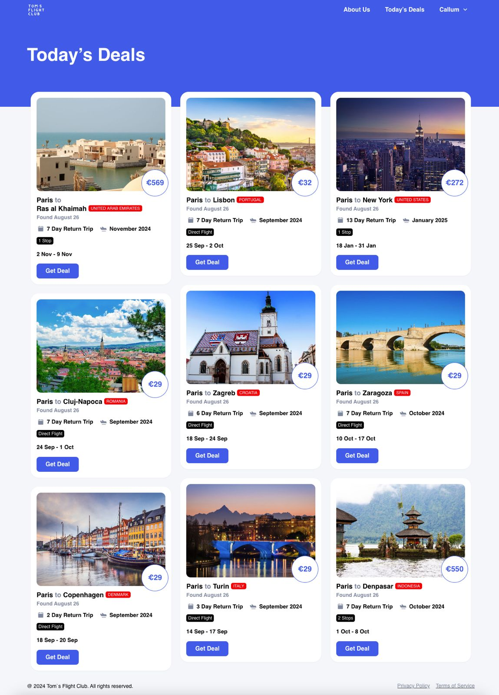
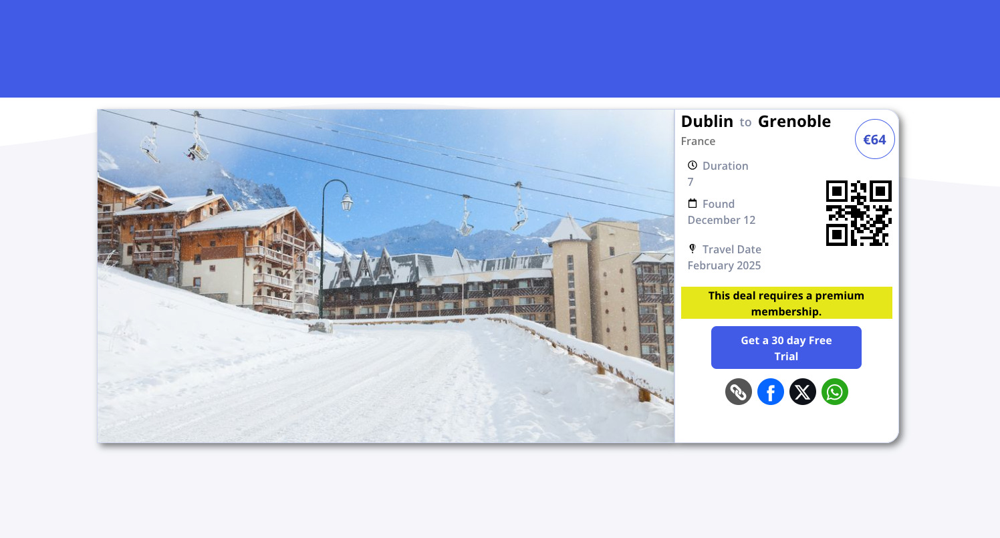
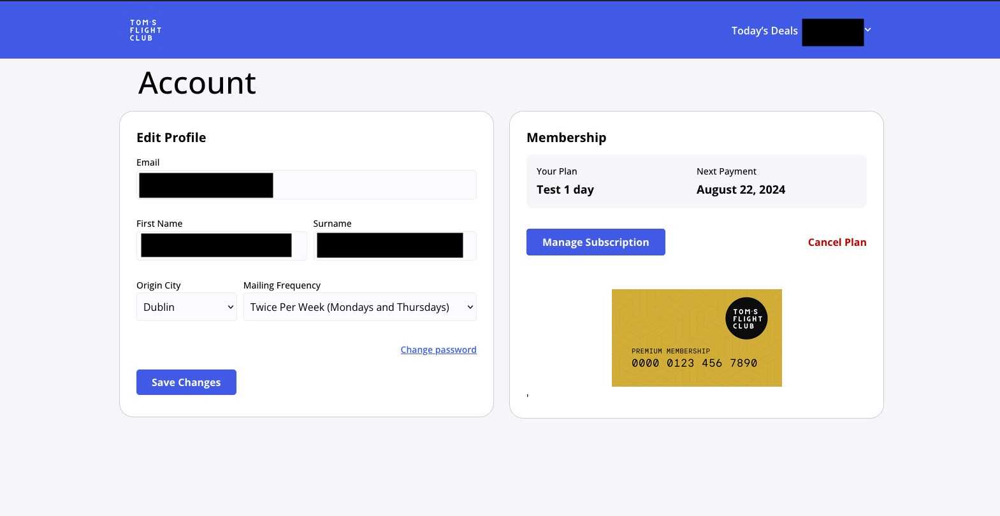
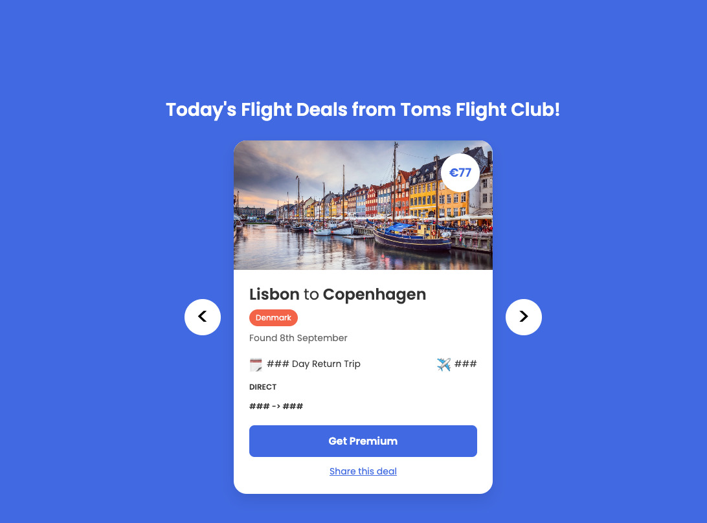

# TFC Flight Club

## Introduction
Toms Flight Club is a website that gives the latest flight deals to its customers through the website dashboard and by email newsletter. 

## Stack
Tom's Flight club is made up of many different components:

- Front end 
    - Wordpress 
    - Google Chrome Extension 
    - Email Newsletter
- Backend 
    - Email integration 
        - Collectng subscriber emails
        - Maintaining subcriber preferences 
        - Emailing the correct users on desired email frequency
    - Flight Deals
        - Integration with third party APIs
        - Filtering for selection of daily deals 
        - Storage of deals for future filtering (MongoDB)
    - AWS API Gateway
        - Querying deals in a scalable way through AWS Lambda 
        - Querying user state for free/paid tier subs
    - Stripe 
        - managing user subscription
        - handling stripe webhooks and communicating with wordpress via ajax
    - Generation
        - generating social media content via scheduled jobs in airtable 
        - generating images via banner bear integration
        - generating voice-over content using elevenlabs integration 

## Backend
The Java Spring backend is responsible for deal generation, deal storage, user email contacts. 

# Considerations
- It was important to me that the backend computes the least amount of API requests for the deals. The 3rd party API stores are expensive and I needed to find a solution that costed the least amount of money. The deal generation was refined over time as monitoring showed that the API was almost maxing out of credits each time. I was able to reduce the number of API calls per origin city from 200 to 89-92. This ensured that I could scale up origin cities without having to purchase the next tier of API credits. 
- THe google chrome extension had to leverage AWS Lambda's as the quote for Lambda's allows millions of requests before payment.
- MongoDB was the obvious choice as I have used it for many years and the free tier works fine. 
- I wanted to keep the backend deal generation and querying separate from the wordpress site. This meant that as more and more users came on board, the deal generation and querying of MongoDB wasn't going to add costs. Scaling would only need to be done on the wordpress website and API Gateway if the API calls reached in the millions.
- I wanted to make sure that the MongoDB collection was always efficient when queried so I created a scheduled job to move deals older than 1 week to another collection which is never queried.

## Website

Every day, a Java Spring scheduled job integrated with multiple third party APIs to evaluate the most recent deals from an origin city. The scheduled job iterates through 52 coutnries and accumulates 5,000 deals approx. before filtering to a chosen 9 deals. The 9 deals are then sent to MongoDB for querying and airtable where many scheduled jobs run based on the state of the data. One of the scheduled jobs sends the deals to wordpress via MAKE integration. 

# Account

Members enjoy 1 free deal per day via the email and the website. Users can activate a 30-day trial via the stripe integration. Using MAKE, MAKE listens for webhooks coming from stripe. WHen a customer changes their subscription in any way, the wordpress site is made aware of those changes. At the same time, Brevo API (for emails) is also notified of the changes. 

Users can enjoy a premium membership which is shown in the image. This allows users to see all 9 deals a day.

# Chrome Extension

The chrome extension was developed to allow users to be able to view deals without going to the website. 
It querys an encoded URL which points to an AWS gateway API which queries MongoDB for the deals. If a user is not found in the request, the result will be all the free deals for the prior 7 days. 

# Final Notes
This website has over 6,000 subscribers with over 15,000 deals posted. 