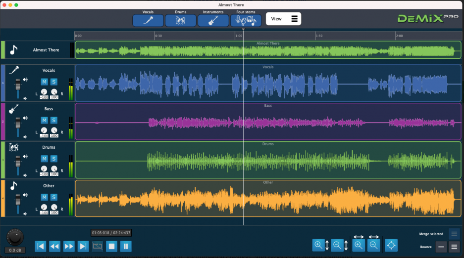
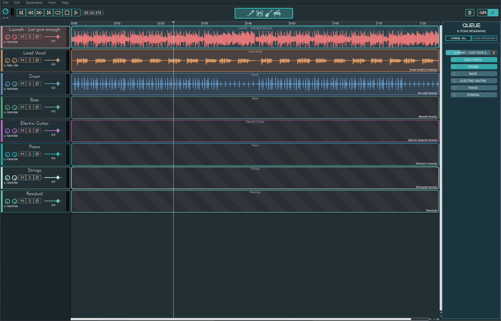

# DeMIX Pro and Essentials 

## Introduction
I began working on DeMIX Pro and Essentials in 2022. 

link:
https://www.audiosourcere.com/products/demix-pro-audio-separation-software

## Original Look And Feel 

The original version of DeMIX Pro and Essentials was very inconsistent. There were different shades of blue for buttons. The top section and bottom section had actions and squeezed the sequencer and made it feel much smaller.  The logo was green which felt wrong with all the blues and dark greys. 

## My design for the latest version

After many considerations, the first idea was to remove the bottom section of the software and attempt to create more space for the sequencer. There was a lot of real estate taken unnecessarily. 
I wanted to make the software feel futuristic as it is related to AI so I made the backgrounds darker but brought a nice bright blue as a contrast. 

# Development notes
Over the years, I've done a lot of development on this software. Since I became involved with the project, it has had:
- a brand new activation experience from the user with PACE integration
- addition of a local separation mode
- removal of a cloud mode option 
- UX/UI redesign with user actions and interactions at the centre of the design 
- new separation workflow 
- batching system to allow users to separate multiple items 
- exporting and resampling of audio 
- sequencer allowing multiple files for separation
- PACE anti piracy protected builds on windows

## Conclusions
The main things to note is that the experience for the user has become a lot more streamlined over the iterations of DeMIX Pro and DeMIX Essentials. 
I focused on user interaction and experience as the primary target for the behaviour of the sequencer in these updates, along with aesthetic changes to make a much more comprehensicve 
and aesthetically pleasing product. 

