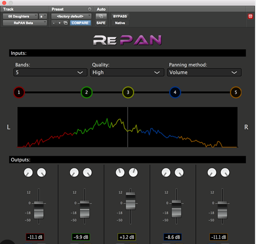
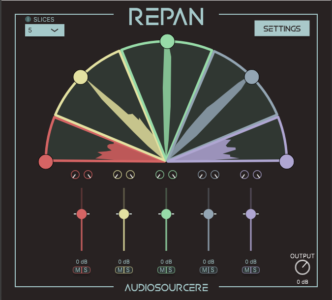
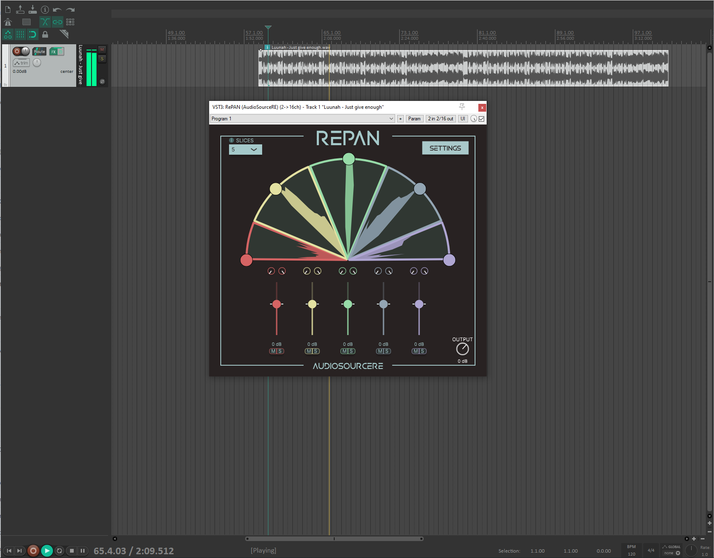

# RePAN Redesign

## Introduction
RePAN is a professional audio plugin that allows for real-time manipulation of the stereo field of an audio input.

link:
https://www.audiosourcere.com/products/repan-audio-separation-plugin-for-daws

## Original V1

RePAN was originally released in 2019, before I joined the company, and featured a bland and confusing UX/UI design. The main issue with the initial version was that the visuals didn’t correlate well with the audio manipulation. The interface was not intuitive, and users had difficulty understanding what was happening in the plugin.

## My Redesign for V2

For the V2 redesign, the primary goal was to rethink how the user would interact with the product and bridge the gap between the audio experience and the visual representation. The most significant change was introducing a semi-circular field to represent the stereo field, a design choice that aligns with common industry practices for panning. This made the manipulation of the audio much easier for users to understand.

Additionally, the color scheme was revamped from the original gray and bland design to a much brighter and more vibrant palette, which gave the plugin a fresh and engaging look.

After several rounds of beta testing, the V2 interface was chosen as a major improvement, and it contributed to a noticeable increase in sales following its release.

## Conclusions

The original RePAN (V1) had a steep learning curve due to its confusing visuals and lack of alignment between the audio and interface. The gray, muted UI also made the product less appealing. However, after the release of V2, RePAN saw a significant boost in sales, as users found the updated design more intuitive and easier to use. The new version enhanced the user experience and made the product more desirable, resulting in greater user satisfaction and increased adoption.

