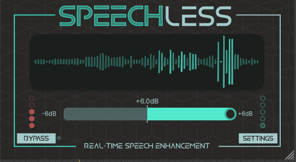
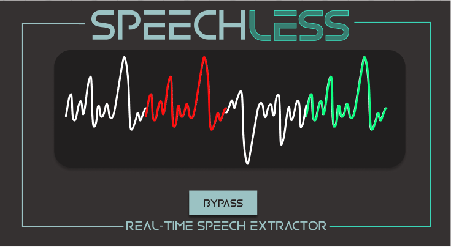
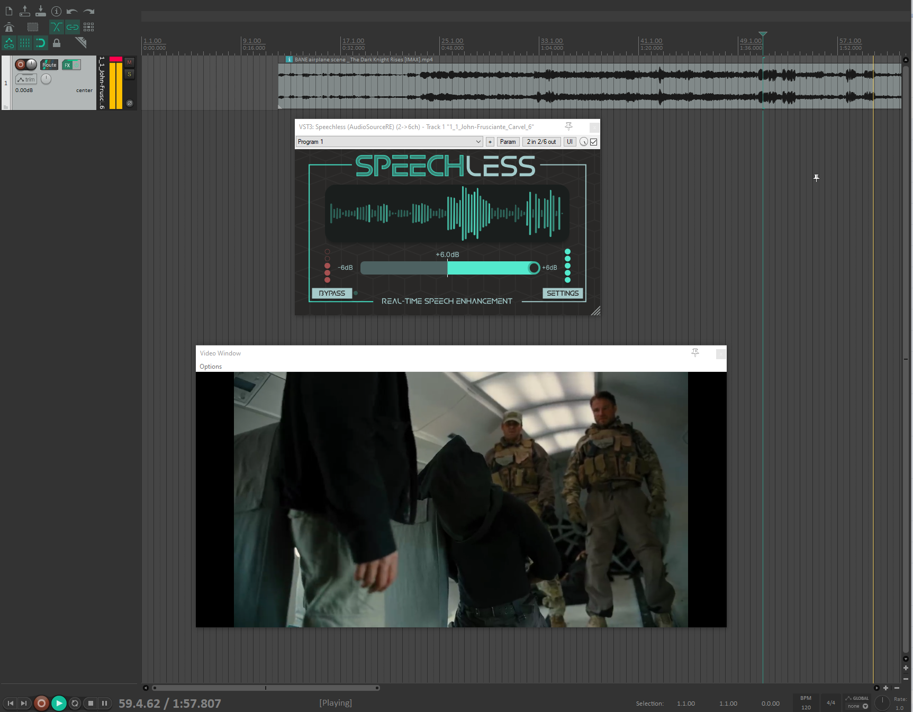

# Speechless 

## Introduction
Speechless is a professional audio plugin that allows for real-time speech separation.

## Original V1

The idea for this product was to develop a speech real-time separation plugin. Like the voxless V2, I wanted to have a dynamic visual element in the product. 

## My original concept

I started with the same framework as the other AI plugins I have created before and kept a consistency between Speechless and the catalog. From the initial idea, you can see that 
the main focus was to have a waveform display the current input and show green for boosting speech and red for attentuating speech. This was to help the user see what is happening visually 
along with the manipulation of the audio. 

## Final version

Speechless was debuted at CES in Las Vegas in 2025. The feedback was extremely positive and promising. 

## Conclusions

The goal was to connect the understanding between visual and audio with this plugin. 

