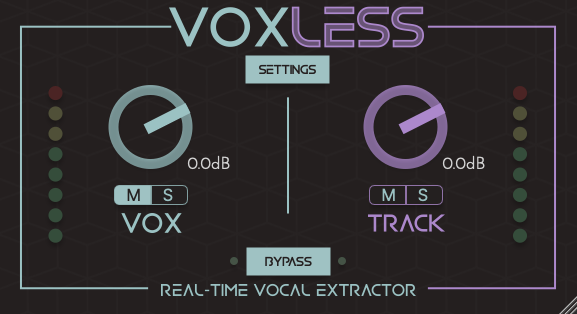
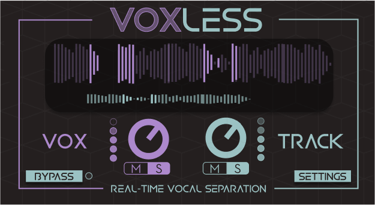

# Voxless 

## Introduction
Voxless is a professional audio plugin that allows for real-time vocal separation.

link:
https://www.audiosourcere.com/products/voxless-real-time-vocal-extraction-plugin-for-daws

## Original V1

The original idea was to have Voxless look like it is part of a collection for collectibility purposes. This is a key component of retaining customers when all the products have a collectible element to them. Each application in the family of applications (Voxless, Drumless, Speechless) has a different colour to signify its unique brand. 

## My Redesign for V2

The main theme for V2 was to have a section of the application that is always moving and capturing the users attention. As voxless has a pink element to it, I thought the most important thing to do is to emphasise this. Adding the waveform captures the attention of the user a lot more than previously and the visuals complement the audio better thabn previously. 

## Conclusions

Voxless V1 was the first implementation of the product where it had its own branding style. Going from V1 to V2, I learnt that it is very important to capture the attention of the audience 
by having a moving element of the design. The moving waveform helps users undestand better what is happening between the vocal separation and the non-vocal separation elements. 

